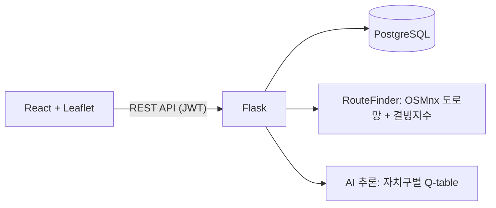

# ❄️ 스스로 학습하는 제설 AI 웹

공공데이터로 서울시 도로의 **결빙지수**를 산출하고, 결빙 위험 구간을 피하는 **안전 경로**와 강화학습 기반 **제설 경로**를 추천하는 웹 서비스입니다.

> 🏅 명지대학교 IC-PBL 경진대회 수상 (2025년 2학기) · 캡스톤디자인

## 왜 만들었나

겨울철 도로 결빙 사고는 어느 도로가 위험한지 미리 알기 어렵다는 데서 시작합니다. 이 프로젝트는 두 사용자를 대상으로 합니다.

- **일반 운전자**: 출발지와 도착지를 입력하면 경로의 결빙 위험도를 확인하고, 위험 구간을 우회하는 경로를 받습니다.
- **제설차 운전자**: 제설 기지를 선택하면 주변 도로를 효율적으로 도는 제설 작업 경로를 추천받습니다.

## 주요 기능

| 기능 | 설명 |
| --- | --- |
| 결빙지수 지도 | 서울시 도로 46,797개의 결빙 위험 점수를 지도에 시각화 |
| 안전 경로 탐색 | 최단 경로와, 위험 구간을 우회하는 안전 경로를 비교 |
| 경로 환경 분석 | 경로의 평균·최고 위험 점수, 위험 구간 목록, 요인별 점수 제공 |
| 제설 경로 추천 | 제설 기지에서 출발해 주변 도로를 작업하고 복귀하는 경로를 AI가 추천 (전문가 계정) |
| 내 경로 · 검색 기록 | 자주 가는 경로 저장, 최근 검색 기록 조회 |
| 사용자 설정 | 프로필·비밀번호 변경, 지도 테마 4종, 결빙지수 표시 기준 조정 |

## 결빙지수

도로마다 다섯 가지 요인을 0–100점으로 정규화한 뒤 합산해 최종 위험 점수를 만듭니다.

| 요인 | 내용 |
| --- | --- |
| 경사 | 급경사일수록 결빙 시 제동 거리가 길어져 위험도 상승 |
| 결빙 취약성 | 서울시 공공데이터의 결빙 취약 도로, 응달·하천 주변 등 결빙되기 쉬운 환경 |
| 사고 이력 | 과거 동절기 결빙 사고 지점 |
| 인구 밀집 | 유동 인구와 교통량이 많아 사고 시 피해가 큰 지역에 가중치 부여 |
| 도로 기본 점수 | 도로 재질과 유형 등 도로 자체의 특성 |

산출 결과는 `backend/final_freezing_score.csv`에 들어 있으며, 등급 분포는 다음과 같습니다.

| 등급 | 도로 수 |
| --- | --- |
| 안전 | 31,867 |
| 주의 | 13,166 |
| 경계 | 1,693 |
| 심각 | 71 |

## 경로 추천 방식

**안전 경로 탐색**

OSMnx로 서울시 차량 도로망 그래프를 만들고, 각 도로(엣지)에 결빙지수를 매핑합니다. 안전 모드에서는 위험 점수가 60점 이상인 도로에 거리의 100배, 80점 이상인 도로에 1,000배의 가중치를 주고 최단 경로를 계산해 위험 구간을 우회합니다.

**제설 경로 추천 (Q-learning)**

- 환경: 제설 기지 반경 3.5km의 도로망
- 상태: 현재 위치와 아직 제설하지 않은 도로 집합
- 행동: 인접한 교차로로 이동
- 추론: 학습된 Q값에 "이동할 곳 주변의 미제설 도로 수" 보너스를 더해 다음 이동을 선택하고, 최근 방문한 지점은 피해 같은 구간을 맴돌지 않게 합니다.
- 최대 400스텝 동안 작업한 뒤 최단 경로로 기지에 복귀합니다.

모델은 서울시 자치구별로 따로 학습합니다.

## 시스템 구조



## 기술 스택

| 구분 | 기술 |
| --- | --- |
| Backend | Python, Flask, Flask-SQLAlchemy, Flask-JWT-Extended, Flask-Bcrypt |
| Database | PostgreSQL |
| 경로 · 데이터 | OSMnx, NetworkX, pandas |
| AI | Q-learning (강화학습) |
| Frontend | React, React Router, Leaflet, React-Leaflet, Axios |

## 프로젝트 구조

```
CapstoneDesign/
├── backend/
│   ├── app.py                     # Flask 서버, DB 모델, REST API
│   ├── ai_inference.py            # Q-learning 제설 경로 추론
│   ├── services/
│   │   └── route_algo.py          # 결빙지수 기반 안전 경로 탐색
│   ├── final_freezing_score.csv   # 도로별 결빙지수
│   └── requirements.txt
└── frontend/
    └── src/
        ├── pages/                 # 로그인, 회원가입, 내 경로, 전문가, 점수 기준
        ├── component/             # 지도, 경로 검색, 사이드바, 설정
        ├── context/               # 인증, 지도 테마
        └── api/
```

## API

| Method | Endpoint | 설명 | 인증 |
| --- | --- | --- | --- |
| POST | `/api/register` | 회원가입 (일반 / 전문가) | |
| POST | `/api/login` | 로그인, JWT 발급 | |
| GET · PATCH | `/api/profile` | 프로필 조회 · 수정 | ✅ |
| PATCH | `/api/password/change` | 비밀번호 변경 | ✅ |
| DELETE | `/api/delete` | 회원 탈퇴 | ✅ |
| GET · POST | `/api/routes` | 내 경로 조회 · 저장 | ✅ |
| DELETE | `/api/routes/<id>` | 내 경로 삭제 | ✅ |
| GET · POST | `/api/history` | 검색 기록 조회 · 저장 | ✅ |
| GET | `/api/bases` | 제설 기지 목록 | |
| GET | `/api/bases/search?q=` | 제설 기지 검색 | |
| POST | `/api/find_safe_route` | 최단 · 안전 경로 탐색 | |
| POST | `/api/professional/recommend` | AI 제설 경로 추천 | ✅ |

## 실행 방법

### 1. Backend

Python 3.12와 PostgreSQL이 필요합니다.

```bash
cd backend
pip install -r requirements.txt
```

`backend/.env` 파일을 만들고 DB 정보를 넣습니다.

```
DB_USER=postgres
DB_PASSWORD=비밀번호
DB_HOST=127.0.0.1
DB_PORT=5432
DB_NAME=postgres
JWT_SECRET_KEY=임의의_긴_문자열
```

```bash
python app.py
```

서버는 `http://127.0.0.1:5000`에서 실행됩니다. 처음 실행할 때 서울시 도로망을 내려받아 그래프를 만들기 때문에 시간이 걸립니다.

### 2. Frontend

```bash
cd frontend
npm install
npm start
```

`http://localhost:3000`에서 열립니다.

### 저장소에 포함되지 않은 것

- **학습된 모델**: `backend/models/q_table_<자치구>.pkl`은 저장소에 올리지 않았습니다. 이 파일이 없으면 제설 경로 추천은 동작하지 않습니다.
- **제설 기지 데이터**: `snow_bases` 테이블은 서버가 자동으로 만들지만, 기지 데이터는 직접 넣어야 합니다.

## 맡은 역할

**장진서** · 팀장 · 백엔드 · 데이터 수집 및 전처리 · AI 학습

- 공공데이터를 수집·전처리해 도로별 결빙지수 산출
- 결빙 사고 데이터가 57건뿐인 한계를 가중치 기준 재설계로 보완
- PostgreSQL DB 설계, Flask RESTful API와 JWT 인증 구현
- 결빙지수를 반영한 안전 경로 탐색 알고리즘 구현
- Q-learning 기반 제설 경로 추천 모델 학습과 추론 서버 연동
