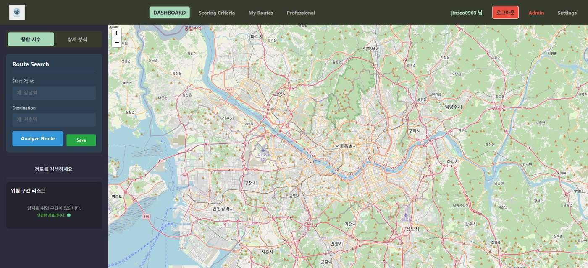
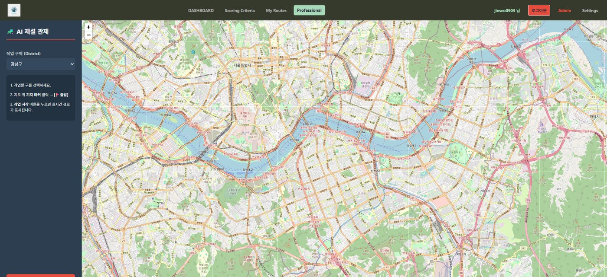
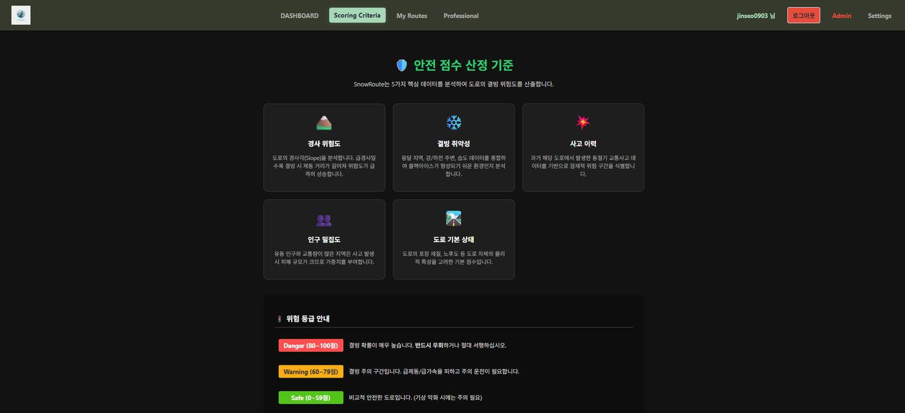
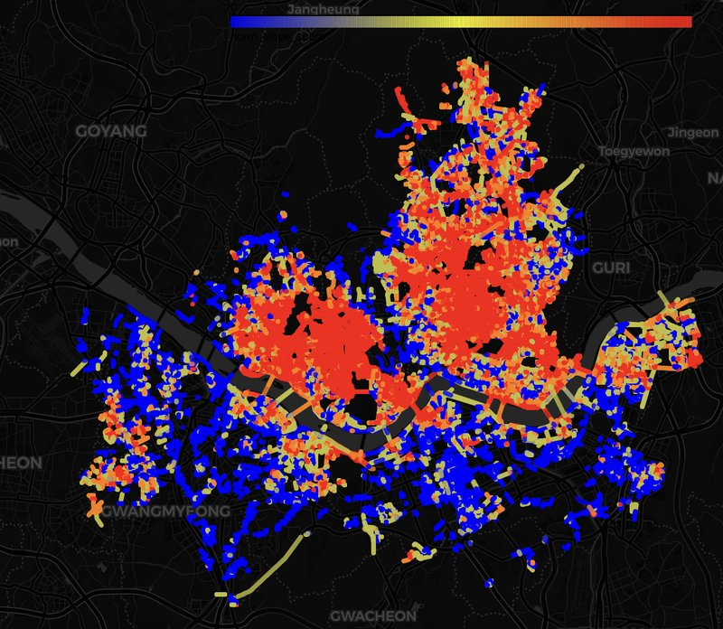
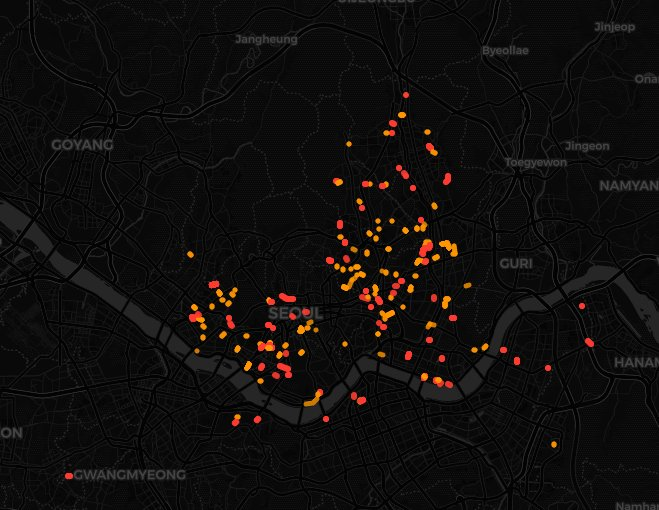
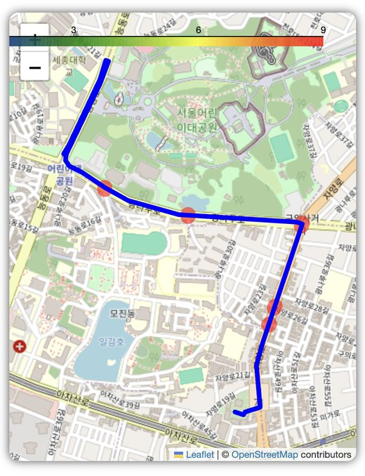
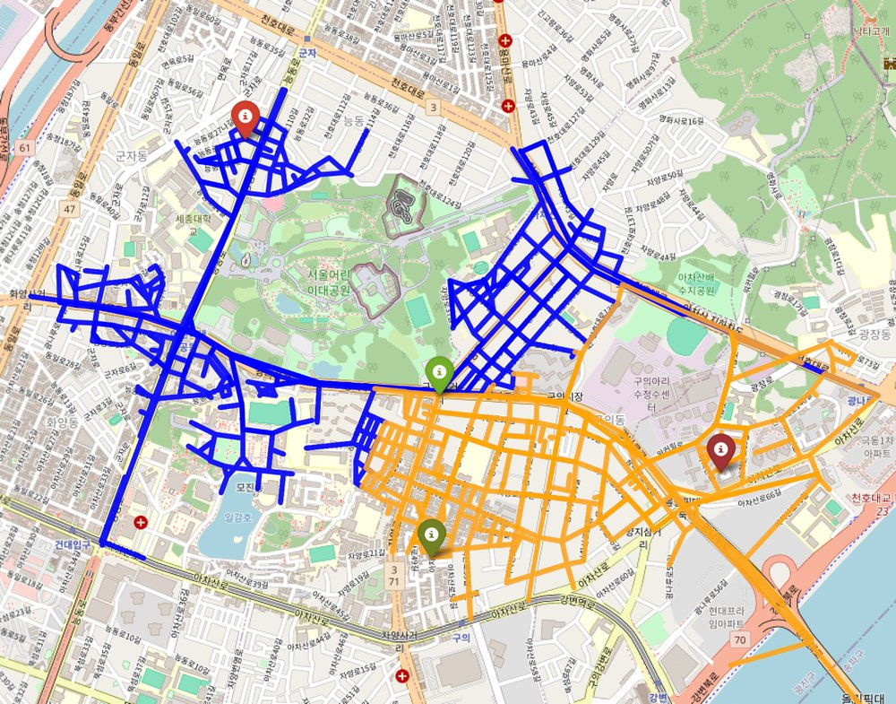
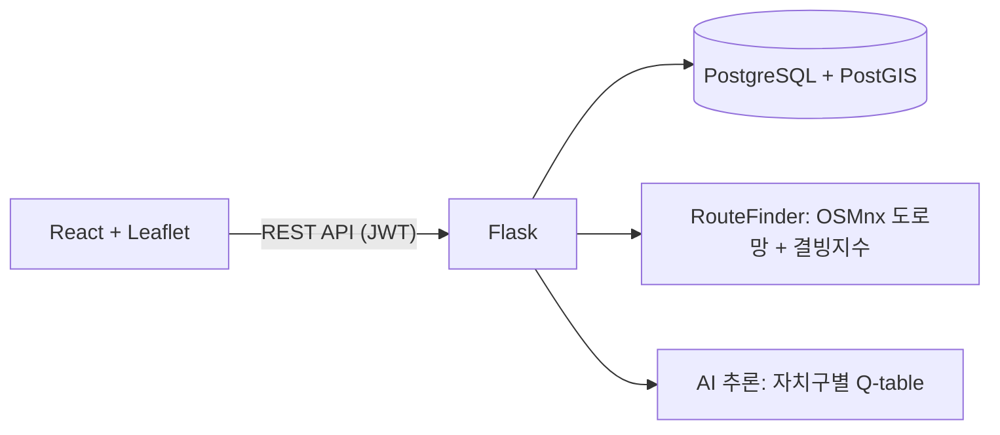

# ❄️ 스스로 학습하는 제설 AI 웹

공공데이터로 서울시 도로의 **결빙지수**를 산출하고, 결빙 위험 구간을 피하는 **안전 경로**와 강화학습 기반 **제설 경로**를 추천하는 웹 서비스입니다.

> 🏅 명지대학교 IC-PBL 경진대회 수상 (2025년 2학기) · 캡스톤디자인
>
> 팀원: 장진서(팀장), 조현주 · 명지대학교 정보통신공학과



## 목차

- [제안 배경](#제안-배경)
- [주요 기능](#주요-기능)
- [화면](#화면)
- [데이터 수집](#데이터-수집)
- [결빙지수 산출](#결빙지수-산출)
- [경로 추천 방식](#경로-추천-방식)
- [시스템 구조](#시스템-구조)
- [기술 스택](#기술-스택)
- [프로젝트 구조](#프로젝트-구조)
- [API](#api)
- [실행 방법](#실행-방법)
- [맡은 역할](#맡은-역할)

## 제안 배경

노면이 결빙된 도로에서는 사고가 훨씬 치명적입니다. 교통사고 치사율은 일반 사고가 1.4인 데 비해 노면 결빙 사고는 2.7이고, 고속도로에서는 4.2에서 18.7까지 올라갑니다.

그런데 어느 도로가 결빙에 취약한지, 제설차가 어떤 순서로 돌아야 효율적인지는 경험에 의존하는 경우가 많습니다. 이 프로젝트는 공공데이터와 AI로 이 두 가지를 해결하려고 했습니다.

- **일반 운전자**: 출발지와 도착지를 입력하면 경로의 결빙 위험도를 확인하고, 위험 구간을 우회하는 경로를 받습니다.
- **제설 관리자 · 제설차 운전자**: 제설 기지를 선택하면 주변 도로를 효율적으로 도는 제설 작업 경로를 추천받습니다.

기대 효과는 결빙 사고 예방, 교통 문제 감소, 반복되는 제설 민원 감소, 제설 예산 절감입니다.

## 주요 기능

| 기능 | 설명 |
| --- | --- |
| 결빙지수 지도 | 서울시 도로 46,797개의 결빙 위험 점수를 지도에 시각화 |
| 안전 경로 탐색 | 최단 경로와, 위험 구간을 우회하는 안전 경로를 비교 |
| 경로 환경 분석 | 경로의 평균·최고 위험 점수, 위험 구간 목록, 요인별 점수 제공 |
| 제설 경로 추천 | 제설 기지에서 출발해 주변 도로를 작업하고 복귀하는 경로를 AI가 추천 (전문가 계정) |
| 내 경로 · 검색 기록 | 자주 가는 경로 저장, 최근 검색 기록 조회 |
| 사용자 설정 | 프로필·비밀번호 변경, 지도 테마 4종, 결빙지수 표시 기준 조정 |

## 화면

| AI 제설 관제 (전문가 계정) | 안전 점수 산정 기준 |
| --- | --- |
|  |  |

## 데이터 수집

공공데이터 14종을 수집해 도로 단위로 결합했습니다.

| 번호 | 데이터 | 활용 | 출처 |
| --- | --- | --- | --- |
| 1 | 한국도로공사 결빙취약구간 현황 | 결빙 구역 확보 | 공공데이터포털 |
| 2 | 행정안전부 상습 결빙구간 | 결빙 구역 확보 | 공공데이터포털 |
| 3 | 서울 전역 도로 데이터 | 서울시 도로 지도 | 국가공간정보포털 |
| 4 | 서울시 등고선 데이터 | 경사도 산출 | 국가공간정보포털 |
| 5 | 서울시 주요 도로 통행량 | 교통량 예측 | View-T |
| 6 | 서울시 기상 데이터 | 결빙지수 분석 | 기상청 API |
| 7 | 서울시 사고 유형별 교통사고 통계 | 사고 위험도 분석 | 공공데이터포털 |
| 8 | 서울시 노면상태별 교통사고 통계 | 사고 위험도 분석 | 공공데이터포털 |
| 9 | 서울시 도로상태별 교통사고 통계 | 사고 위험도 분석 | 공공데이터포털 |
| 10 | 기상상태별 교통사고 현황 | 사고 위험도 분석 | 서울 열린데이터광장 |
| 11 | 서울특별시 교량·터널 통합 모니터링 | 공간 변수 | 공공데이터포털 |
| 12 | 기상청 시간별 기온 | 기상 복합 변수 | 기상청 |
| 13 | 한국도로공사 상시 교통량 조사 (출퇴근 시간대) | 시간 변수 | 공공데이터포털 |
| 14 | 서울시 제설 전진기지 위치 정보 | 제설차 출발·도착지 | 공공데이터포털 |

수집한 데이터는 다섯 가지 요인으로 묶었습니다.

| 요인 | 사용 데이터 |
| --- | --- |
| 경사도 | 등고선, 경사도 |
| 통행량 | 직장 인구, 상주 인구, 출퇴근 시간 교통량, 통행량 |
| 도로 특성 | 노면 재질, 도로 구조물(교량·터널), 도로 종류, 노면 온도, 음영 지역 |
| 사고 발생량 | 결빙 사고 발생 구간, 기상상태별 교통사고 현황 |
| 결빙 취약 구간 | 상습 결빙 구간, 결빙 취약 구간 |

| 경사도 분석 | 위험 도로 상위 500개 |
| --- | --- |
|  |  |

## 결빙지수 산출

요인별 점수를 0–100점으로 정규화한 뒤 가중합으로 도로별 최종 위험 점수를 만듭니다. 가장 어려웠던 부분은 가중치를 정하는 일이었습니다.

**1. 회귀 분석과 엔트로피 가중치를 시도**

실제로 결빙이 발생한 구역을 1로 두고 요인별 회귀 분석을 했습니다.

| 변수 | 회귀 계수 | 정규화된 가중치 |
| --- | --- | --- |
| 경사도 | +0.0002189 | 23.31% |
| 통행량 | +0.0002693 | 28.69% |
| 도로 특성 | −0.0001402 | −14.94% |
| 사고 발생량 | −0.0003104 | −33.06% |

사고가 많은 구간일수록 결빙과 반대로 나오는 등 직관과 다른 결과가 나왔고, 엔트로피 기반 가중치와도 서로 다른 결과가 나왔습니다.

**2. 원인: 결빙 데이터 부족**

원인을 찾아 보니, 4만여 개 도로 가운데 실제 결빙 구역으로 확인되는 자료가 57건뿐이었습니다. 이 정도 표본으로는 통계적으로 가중치를 학습시킬 수 없다고 판단했습니다.

**3. 해결: 목적 기반 가중치**

결빙 취약 구간 자료를 더 구할 수 없었기 때문에, 자료가 도로 전체에 고르게 확보된 경사도와 통행량의 가중치를 높게 두고, 도로 특성, 사고 발생량, 결빙 취약 구간 순으로 가중치를 정했습니다.

산출 결과는 `backend/final_freezing_score.csv`에 들어 있으며, 등급 분포는 다음과 같습니다.

| 등급 | 도로 수 |
| --- | --- |
| 안전 | 31,867 |
| 주의 | 13,166 |
| 경계 | 1,693 |
| 심각 | 71 |

## 경로 추천 방식

### 안전 경로 탐색

OSMnx로 서울시 차량 도로망 그래프를 만들고, 각 도로(엣지)에 결빙지수를 매핑합니다. 안전 모드에서는 위험 점수가 60점 이상인 도로에 거리의 100배, 80점 이상인 도로에 1,000배의 가중치를 주고 최단 경로를 계산해 위험 구간을 우회합니다.



### 제설 경로 추천 (강화학습)

| 구성 요소 | 내용 |
| --- | --- |
| 환경 | 결빙 위험도가 반영된 도로 네트워크 (제설 기지 반경 3.5km) |
| 에이전트 | 제설 차량 |
| 상태 | 현재 위치와 아직 제설하지 않은 도로 집합 |
| 행동 | 다음에 이동해 제설할 도로 선택 |
| 보상 | 주요 도로 제설 완료, 짧은 시간에 넓은 면적 처리, 결빙 고위험 지역 우선 처리, 골목 우선 제설 |
| 패널티 | 연료·제설제 낭비, 작업 경로 중복, 지나치게 돌아가는 경로, 골목을 건너뛰는 경우 |

제설차는 실제 운영 방식에 맞춰 제설 발진기지나 전진기지에서 출발하고 같은 기지로 복귀합니다.

- **발진기지**: 구청, 사업소 등 중심부에 있는 본부. 대부분의 차량과 장비를 보관합니다.
- **전진기지**: 사고가 잦은 구간 근처에 배치된 소규모 기지. 출동 시간을 줄이는 역할을 합니다.

**학습 과정과 결과**

- 제설차 두 대를 동시에 운행시키고, 두 차량이 비슷한 양의 도로를 맡도록 했습니다.
- 결빙지수가 가장 높은 구역이 작업 범위 안에 있으면 반드시 제설하도록 보상을 조정했습니다.
- 그 결과 설정한 구역에서 제설되지 않은 도로가 0이 되었고, 탐험률(ε)은 0.05까지 낮췄습니다.



**추론**

서비스에서는 자치구별로 학습한 Q-table을 불러와 경로를 만듭니다. 학습된 Q값에 "이동할 곳 주변의 미제설 도로 수" 보너스를 더해 다음 이동을 고르고, 최근 방문한 지점은 피해 같은 구간을 맴돌지 않게 합니다. 최대 400스텝 동안 작업한 뒤 최단 경로로 기지에 복귀합니다.

## 시스템 구조



## 기술 스택

| 구분 | 기술 |
| --- | --- |
| Backend | Python, Flask, Flask-SQLAlchemy, Flask-JWT-Extended, Flask-Bcrypt |
| Database | PostgreSQL, PostGIS |
| 경로 · 데이터 | OSMnx, NetworkX, pandas |
| AI | Q-learning (강화학습) |
| Frontend | React, React Router, Leaflet, React-Leaflet, Axios |
| 외부 API | OpenStreetMap Nominatim (주소 검색) |

## 프로젝트 구조

```
CapstoneDesign/
├── backend/
│   ├── app.py                     # Flask 서버, DB 모델, REST API
│   ├── ai_inference.py            # Q-learning 제설 경로 추론
│   ├── services/
│   │   └── route_algo.py          # 결빙지수 기반 안전 경로 탐색
│   ├── final_freezing_score.csv   # 도로별 결빙지수
│   └── requirements.txt
├── frontend/
│   └── src/
│       ├── pages/                 # 로그인, 회원가입, 내 경로, 전문가, 점수 기준
│       ├── component/             # 지도, 경로 검색, 사이드바, 설정
│       ├── context/               # 인증, 지도 테마
│       └── api/
└── docs/
    └── images/                    # README 이미지
```

## API

| Method | Endpoint | 설명 | 인증 |
| --- | --- | --- | --- |
| POST | `/api/register` | 회원가입 (일반 / 전문가) | |
| POST | `/api/login` | 로그인, JWT 발급 | |
| GET · PATCH | `/api/profile` | 프로필 조회 · 수정 | ✅ |
| PATCH | `/api/password/change` | 비밀번호 변경 | ✅ |
| DELETE | `/api/delete` | 회원 탈퇴 | ✅ |
| GET · POST | `/api/routes` | 내 경로 조회 · 저장 | ✅ |
| DELETE | `/api/routes/<id>` | 내 경로 삭제 | ✅ |
| GET · POST | `/api/history` | 검색 기록 조회 · 저장 | ✅ |
| GET | `/api/bases` | 제설 기지 목록 | |
| GET | `/api/bases/search?q=` | 제설 기지 검색 | |
| POST | `/api/find_safe_route` | 최단 · 안전 경로 탐색 | |
| POST | `/api/professional/recommend` | AI 제설 경로 추천 | ✅ |

## 실행 방법

### 1. Backend

Python 3.12와 PostgreSQL이 필요합니다.

```bash
cd backend
pip install -r requirements.txt
```

`backend/.env` 파일을 만들고 DB 정보를 넣습니다.

```
DB_USER=postgres
DB_PASSWORD=비밀번호
DB_HOST=127.0.0.1
DB_PORT=5432
DB_NAME=postgres
JWT_SECRET_KEY=임의의_긴_문자열
```

```bash
python app.py
```

서버는 `http://127.0.0.1:5000`에서 실행됩니다. 처음 실행할 때 서울시 도로망을 내려받아 그래프를 만들기 때문에 시간이 걸립니다.

### 2. Frontend

```bash
cd frontend
npm install
npm start
```

`http://localhost:3000`에서 열립니다.

### 저장소에 포함되지 않은 것

- **학습된 모델**: `backend/models/q_table_<자치구>.pkl`은 저장소에 올리지 않았습니다. 이 파일이 없으면 제설 경로 추천은 동작하지 않습니다.
- **제설 기지 데이터**: `snow_bases` 테이블은 서버가 자동으로 만들지만, 기지 데이터는 직접 넣어야 합니다.

## 맡은 역할

**장진서** · 팀장 · 백엔드 · 데이터 수집 및 전처리 · AI 학습

- 공공데이터 14종을 수집·전처리해 도로별 결빙지수 산출
- 결빙 데이터가 57건뿐인 한계를 확인하고 목적 기반 가중치로 재설계
- PostgreSQL·PostGIS DB 설계, Flask RESTful API와 JWT 인증 구현
- 결빙지수를 반영한 안전 경로 탐색 알고리즘 구현
- Q-learning 기반 제설 경로 추천 모델 학습과 추론 서버 연동
